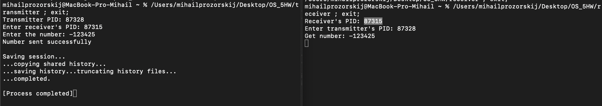
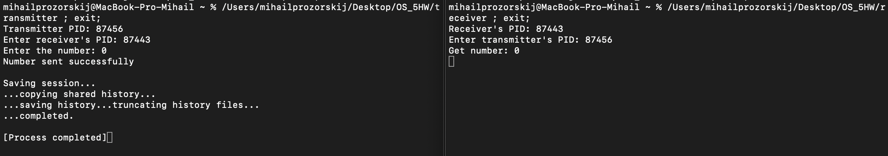
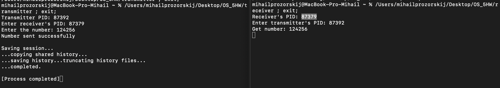

# OS_HW5
# Прозорский Михаил Алексеевич
# БПИ224

## Условие
Побитовая передача целого числа от одного процесса другому с помощью сигналов SIGUSR1, SIGUSR2
Необходимо написать две программы — передатчик и приемник , которые будут запускаться с разных терминалов. Каждая программа в начале печатает свой PID и запрашивает ввод с клавиатуры PID программы–собеседника (вводится пользователем). Порядок ввода PID не имеет значения. Программа—передатчик запрашивает с клавиатуры ввод целого десятичного числа (число может быть и отрицательным!). Введенное число побитово передается программе-приемнику с использованием пользовательских сигналов SIGUSR1 и SIGUSR2. Программа–приемник после завершения приема печатает принятое число в десятичной системе счисления.

До 7 баллов
Каждый бит (0 или 1) передается своим сигналом. Из-за ненадежности сигналов передача последовательности одинаковых битов может приводить к ошибкам. Особенно при односторонней передаче без обратной связи. Но можно попытаться повысить (в общем случае негарантированно) за счет задержки. На данную оценку допустим такой вариант решения.

До 10 баллов
Каждый новый бит можно передавать только после подтверждения от приемника принятия предыдущего с помощью одного из пользовательских сигналов, организуя асинхронное взаимодействие. Также необходимо продумать каким образом асинхроно (а не по числу переданных бит) завершить передачу между источником и приемником.

## Решение
Приведено в соответствующих файлах(transmitter.c, reciever.c)

#### Примечание
Если скомпилированные файлы не запускаются, то их следует удалить и перекомпилировать следующими командами(к примеру используя gcc):

###### gcc receiver.c -o receiver
###### gcc transmitter.c -o transmitter

## Тесты
### Отрицательное число

### Ноль

### Положительное число

